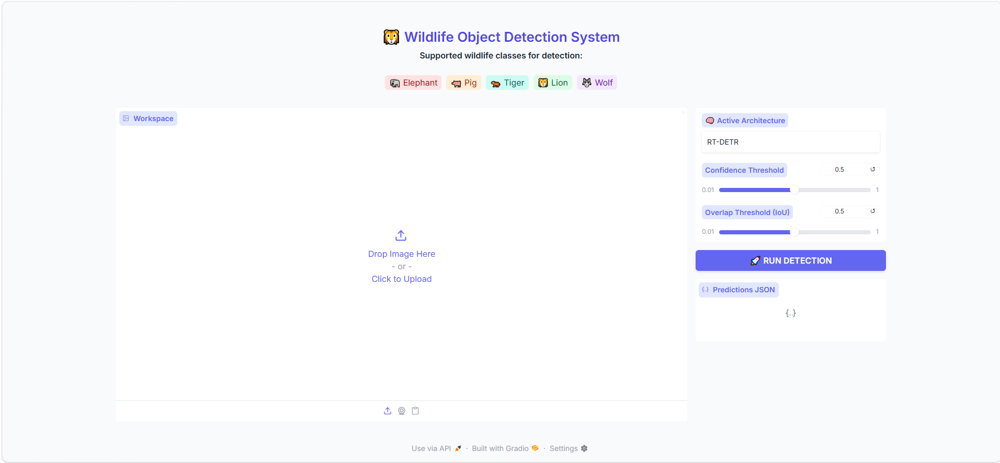
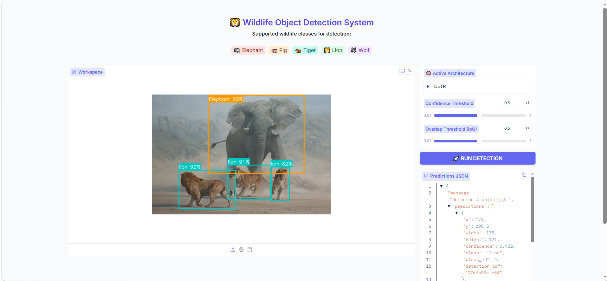
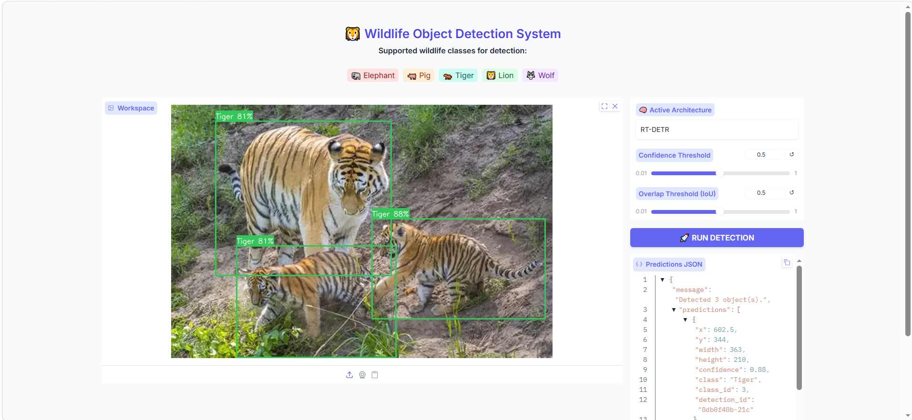
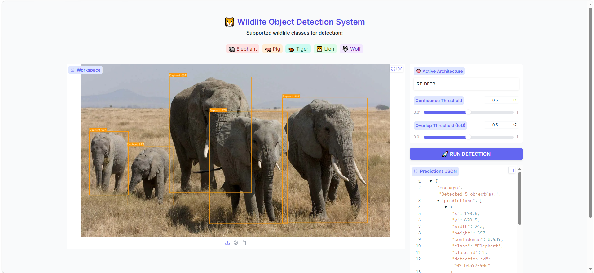

# Object Detection Application

Ứng dụng nhận dạng đối tượng dành cho động vật hoang dã sử dụng Deep Learning với 5 lớp:

* 🐘 Elephant
* 🐖 Pig
* 🐅 Tiger
* 🦁 Lion
* 🐺 Wolf

Dự án tập trung vào việc xây dựng, huấn luyện, đánh giá và triển khai nhiều kiến trúc Object Detection hiện đại nhằm so sánh hiệu năng giữa các hướng tiếp cận khác nhau.

---

# Nội dung dự án

Dự án bao gồm các thành phần chính:

* Xây dựng và tiền xử lý bộ dữ liệu Object Detection
* Huấn luyện và đánh giá nhiều kiến trúc Deep Learning:

  * CNN-based: Faster R-CNN
  * YOLO-based: YOLOv8
  * Transformer-based: RT-DETR
* So sánh hiệu năng giữa các mô hình
* Triển khai mô hình thành ứng dụng Web bằng Gradio

---

# Features

* Dataset preprocessing & augmentation
* Model training & evaluation
* Inference trên ảnh tùy chỉnh
* Triển khai Web UI bằng Gradio
* So sánh hiệu năng giữa các kiến trúc

---

# 📁 Project Structure

```bash
animal-detection/
│
├── data/                       # Dữ liệu raw và processed
│
├── notebooks/                  # Notebook cho EDA & preprocessing
│
├── src/
│   ├── models/
│   │   ├── yolo.py
│   │   ├── cnn.py
│   │   └── transformer.py
│   │
│   └── main.py
│
├── outputs/                    # Trọng số mô hình đã huấn luyện
│   ├── cnn/
│   ├── rtdetr/
│   └── yolov8m/
│
├── app.py                      # File chạy Gradio Web UI
├── requirements.txt
├── README.md
└── .gitignore
```

---

# Requirements

* Python >= 3.10
* Git
* CUDA GPU (khuyến nghị để tăng tốc inference/training)

---

# Installation

## 1. Clone Repository

```bash
git clone <your-repository-url>
cd object-detection-app
```

---

## 2. Tạo Virtual Environment

### Windows

```bash
python -m venv venv
venv\Scripts\Activate.ps1
```

### Linux / MacOS

```bash
python3 -m venv venv
source venv/bin/activate
```

---

## 3. Cài đặt thư viện

```bash
python -m pip install --upgrade pip
pip install -r requirements.txt
```

---

# Chuẩn bị Data & Model Weights

Do giới hạn dung lượng, dữ liệu và trọng số mô hình không được lưu trực tiếp trên repository.

Tải thủ công thông qua các đường link được cung cấp.

---

## Bước 1: Tải Dataset

Link tải dữ liệu được lưu trong:

```bash
data/raw/link_raw.txt
data/processed/link_processed.txt
```

Sau khi tải về:

* Giải nén đúng vào:

  * `data/raw/`
  * `data/processed/`

> Có thể tự tiền xử lý dữ liệu bằng notebook:
>
> `notebooks/eda_and_preprocessing.ipynb`

---

## Bước 2: Tải Model Weights

Link tải trọng số mô hình nằm trong:

```bash
outputs/link_outputs.txt
```

Sau khi tải về, giải nén vào thư mục `outputs/` theo đúng cấu trúc:

```bash
outputs/
├── rtdetr/
│   └── best_rtdetr/
│
├── cnn/
│   └── best.pth
│
└── yolov8m/
    └── weights/
        └── best.pt
```

## ▶️ Chạy Training / Evaluation
Có thể chạy lại toàn bộ quá trình train, validation và test cho từng mô hình bằng các lệnh sau:
### Faster R-CNN

```bash
python src/main.py --model cnn
```

---

### RT-DETR

```bash
python src/main.py --model transformer
```

---

### YOLOv8

```bash
python src/main.py --model yolo
```
Sau khi hoàn tất, trọng số mô hình và các kết quả đánh giá sẽ được lưu trong thư mục:
outputs/

---

# ▶️ Run Application

Sau khi chuẩn bị đầy đủ dữ liệu và weights, có thể chạy ứng dụng Gradio bằng các lệnh dưới đây.

---

## RT-DETR (Transformer-based)

```bash
python app.py --model detr --path outputs/rtdetr/best_rtdetr
```

---

## Faster R-CNN (CNN-based)

```bash
python app.py --model rcnn --path outputs/cnn/best.pth
```

---

## YOLOv8

```bash
python app.py --model yolo --path outputs/yolov8m/weights/best.pt
```

---

# 🌐 Web Interface

Sau khi chạy lệnh, terminal sẽ hiển thị một đường dẫn nội bộ, ví dụ:

```bash
http://127.0.0.1:7860
```

Mở đường dẫn này trên trình duyệt để sử dụng ứng dụng.

## Giao diện ứng dụng

<p align="center">
  
</p>

<p align="center">
  <i>Gradio Web UI cho hệ thống Wildlife Object Detection</i>
</p>

# Detection Results

## Multi-Class Detection

<p align="center">
  
</p>

---

## Single-Class Detection

<p align="center">
  
</p>

<p align="center">
  
</p>

